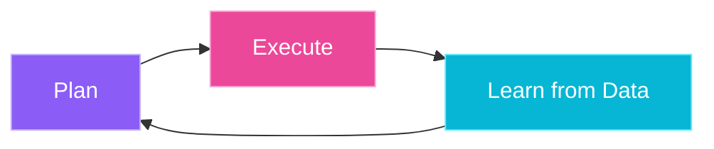

### Hi, I'm Kauan 👋

Computer Science student focused on backend engineering, data systems, and applied AI.

I build backend systems, data pipelines, and AI applications focused on solving real-world problems. Check my projects at: https://www.kauanrakoski.com.br

#### Tech Stack 

  
  
  
  
  
  

 

